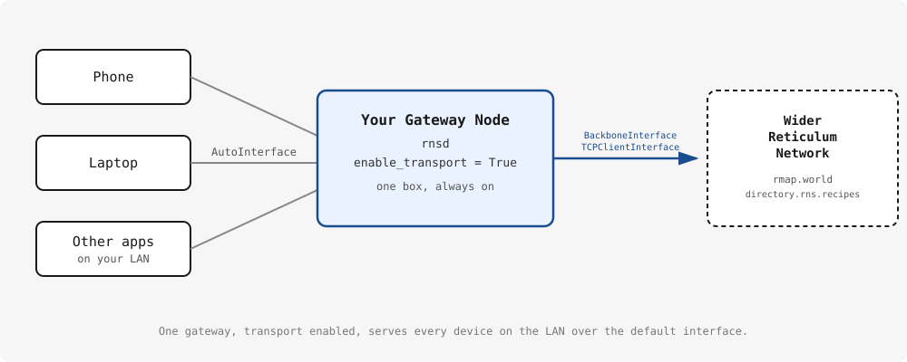

+++
date = '2026-08-23T09:00:00-06:00'
draft = true
title = 'Standing Up a Reticulum Gateway'
description = 'Fundamentals of Reticulum, and how to build your own always-on gateway node — the first post in a series on the mesh network infrastructure I run at home.'
tags = ['reticulum', 'networking', 'self-hosted']
ShowToc = true
TocOpen = true
+++

I've spent the last few months building out a small Reticulum network at home: a gateway node,
a LoRa radio for long-range off-grid reach, and a NomadNet page server that other people on the
network can actually browse to. This is the first post in a series where I walk through how I
built each piece, and — more importantly — what I'd tell you to do differently if you're starting
from scratch.

This post covers the foundation everything else sits on: a Reticulum gateway node.

## What Reticulum actually is

Reticulum isn't an app and it isn't a service you sign up for. It's a networking stack — a set of
tools for building encrypted, self-configuring networks that keep working even over painfully
slow or unreliable links. It doesn't need IP underneath it, though it's happy to run over TCP/UDP
when that's convenient, and it doesn't need any central authority to function. You just decide
which interfaces (LAN, TCP over the internet, a LoRa radio, whatever you have) your node should
use, and Reticulum handles discovering the rest of the network and routing traffic through it.

That "no central authority" part matters for how you should think about your own node. There's no
single Reticulum network you join — there's a web of people running their own infrastructure and
choosing how much of it to connect together. Which brings me to the first real concept worth
understanding before you touch any hardware.

## Transport nodes vs. leaf nodes

Every Reticulum instance can either just talk to its own local peers (a **leaf node**), or actively
relay traffic on behalf of the wider network (a **transport node**). The default configuration
Reticulum creates the first time you run it is a leaf node — it only sees other Reticulum peers
already reachable on your local network.

The useful pattern, if you have more than one device that wants Reticulum connectivity, is to pick
**one** machine on your network, give it whatever external interfaces you want (a TCP link to the
internet, a LoRa radio, whatever), and turn on transport for it. Every other device in your house
then just talks to that one gateway over the default local interface, and gets the benefit of
everything the gateway is connected to — without needing to be configured with any of it directly.

That's the whole shape of what I'm building in this post:



## Installing it

Reticulum ships as a normal Python package:

```bash
pip install rns
```

On a Raspberry Pi (or most recent Debian-based systems), `pip` won't let you install system-wide
without a flag:

```bash
sudo apt install python3 python3-pip python3-cryptography python3-pyserial
pip install rns --break-system-packages
```

That flag looks scarier than it is — it just allows `pip` to install user- and system-wide, and
won't actually break anything on your system.

Once it's installed you get a handful of command-line tools alongside the library itself:
`rnsd` runs Reticulum as a background service, and `rnstatus`, `rnpath`, and `rnprobe` let you
inspect what your instance can see. The first time `rnsd` runs, it creates a default config file
at `~/.reticulum/config` with a single interface active — the default `AutoInterface`, which just
uses your existing Ethernet/WiFi to find other Reticulum peers on the same LAN.

To turn this machine into a gateway, the config needs two things: transport enabled, and at least
one interface that reaches outside your LAN.

```ini
[reticulum]
  enable_transport = True
  share_instance = Yes
```

## Connecting outward

The simplest way to reach beyond your LAN is a `TCPClientInterface` pointed at someone else's
public entrypoint:

```ini
[interfaces]
  [[Some Public Gateway]]
    type = TCPClientInterface
    enabled = yes
    target_host = <their address>
    target_port = 4242
```

You can find real, currently-active entrypoints to connect to at
[rmap.world](https://rmap.world/) and [directory.rns.recipes](https://directory.rns.recipes/) —
both are directories the wider Reticulum community maintains specifically so new nodes have
somewhere to start. Worth calling out: don't treat whatever entrypoint you pick as a permanent,
load-bearing link. Reticulum works best when connectivity grows organically — use a public
entrypoint as a bootstrap, let Reticulum's interface discovery find you more local and relevant
peers over time, and lean on more than one connection if you can. A network that only stays up
because of one hardcoded IP address isn't very resilient.

If you'd rather be the entrypoint — something other people can connect *to*, not just something
you connect out from — a `BackboneInterface` in `gateway` mode is the better tool, and it's what
I'd reach for if you have a stable machine with a reachable IP:

```ini
[interfaces]
  [[Public Gateway]]
    type = BackboneInterface
    enabled = yes
    mode = gateway
    listen_on = 0.0.0.0
    port = 4242

    # essential on anything publicly reachable
    announce_rate_target = 3600
    announce_rate_penalty = 3600
    announce_rate_grace = 6
```

`BackboneInterface` is functionally compatible with `TCPClientInterface`/`TCPServerInterface` but
noticeably lighter on resources — it can handle a lot more simultaneous connections on the same
small hardware. The `mode = gateway` setting matters here too: it tells Reticulum this interface
should actively help newcomers discover paths to unknown destinations, which meaningfully speeds
up how quickly people connecting to you get useful connectivity. I'll get into Reticulum's other
interface modes — and a real mistake I made with them — in a later post in this series.

The `announce_rate_*` options are worth taking seriously the moment your interface is reachable by
strangers: without some kind of rate limiting, a public interface is an easy target for accidental
or deliberate announce flooding.

## Architecture: one box, not two

Here's the advice I actually want you to walk away with, because my own setup is a cautionary
example rather than a template to copy: **run this on one reasonably capable device.** A Raspberry
Pi 4 or 5 has more than enough headroom to run `rnsd`, a NomadNet instance, and `lxmd` (the LXMF
propagation daemon) together on a single box, and that's the simplest, easiest-to-reason-about way
to start.

It doesn't have to be a Pi, either — that's just what I had on hand, and it's why the numbers below
are Pi numbers. An old laptop, a mini PC, a NUC, a spare VM, whatever you've already got sitting
around with a bit of headroom works exactly the same way. Reticulum doesn't care what it's running
on.

I didn't start there. My gateway node was originally a Raspberry Pi 3 B running `rnsd`, two
separate `nomadnet` instances, and `lxmd` all at once — and it showed. Load average sat around 9,
RAM usage at 84%, with 731MB in swap. Breaking down CPU usage across the four daemons made it
obvious none of them were being unreasonable individually (`rnsd` at 42%, the main `nomadnet` at
37%, the second `nomadnet` instance at 29%, `lxmd` at 25%) — there just wasn't enough Pi to go
around.

The fix was moving just `rnsd` — the transport daemon, along with all of its interfaces — onto a
second Raspberry Pi (a 3 B+) that happened to be sitting nearly idle at load average 0.57 and 42%
RAM, already doing unrelated monitoring work. That one move freed roughly 42% CPU and 20% RAM back
on the original Pi, which was enough to make the remaining daemons comfortable again.


If you're starting fresh, skip that whole chapter — get a Pi 4/5 (or better) and run everything on
it. The split only earns its complexity if you're stuck on genuinely weak or already-busy
hardware, or if you specifically want your radio interface reachable independently of everything
else running on the gateway. I'll cover that second case properly when I get to the LoRa gateway
post, because that's actually where the split starts to make more sense.

## Checking it's alive

Once `rnsd` is running — either in the foreground for testing, or as a background service — the
quickest sanity check is:

```bash
rnstatus
```

This lists every configured interface and whether it's currently active. If your outward interface
shows up connected, you've got a working gateway: any other Reticulum-aware device on your LAN can
now reach the wider network through it, using nothing more than the default configuration.

## Testing it with a real client

`rnstatus` tells you the gateway itself is alive, but the real test is whether another device can
actually use it. Install a client on your phone or laptop and leave its config at the defaults.
A few good options:

- [Columba](https://columba.network/) — Android ([iOS version](https://github.com/torlando-tech/Columba-iOS)
  also available) — a native mobile LXMF messaging app, Bluetooth LE / WiFi / LoRa (RNode) / TCP.
  This is the one I actually use day to day and recommend over Sideband.
- [Sideband](https://unsigned.io/sideband) — Android, iOS, and desktop.
- [MeshChatX](https://meshchatx.com) — desktop/web, a feature-rich fork of the original Reticulum
  MeshChat.

That's the part I find genuinely satisfying about this setup: by default, these apps run their own
Reticulum instance with nothing but the same `AutoInterface` I mentioned earlier. As long as the
device is on the same LAN as your gateway, it picks the gateway up automatically — no manual peer
configuration, no pasting in addresses. Once connected, the client inherits everything the gateway
can reach: send a message or check for announces, and you should start seeing traffic from the
wider network the gateway is connected to, not just your own LAN.

If that works, the whole point of this post is proven out: one gateway, transport enabled, and
every other device on the network gets full reach through it for free.

## Next up

At this point I've got a bare gateway — LAN on one side, a single link out to the wider network on
the other. It works, but it's not doing anything a plain internet connection couldn't do. The next
post covers what actually makes this interesting: adding a LoRa radio (a Heltec V3 running RNode
firmware) so the gateway has real long-range, infrastructure-free reach — and the airtime problem
I ran into almost immediately after turning it on.
